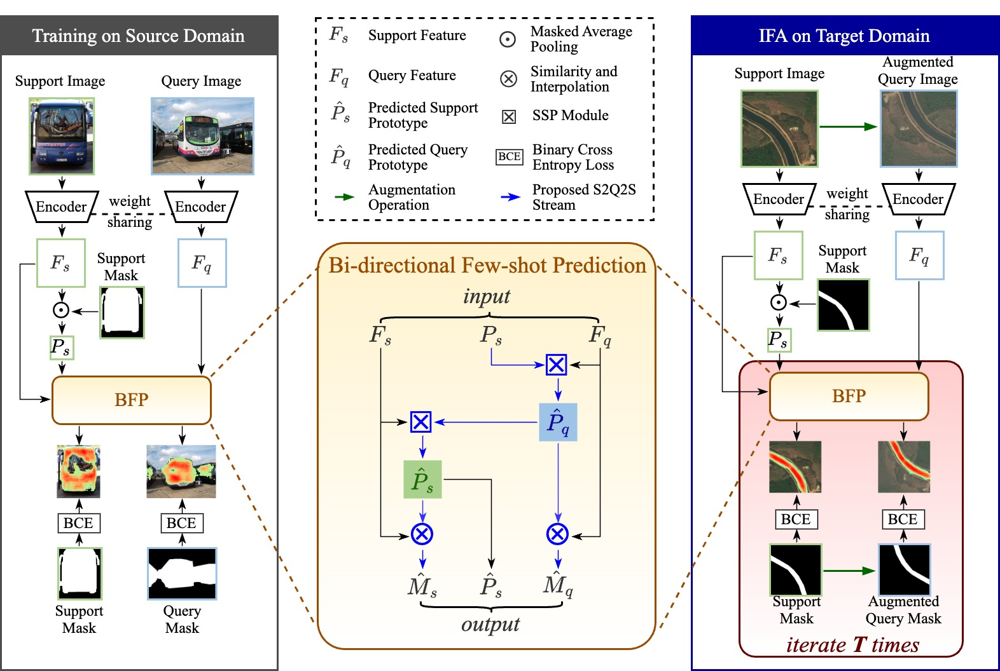
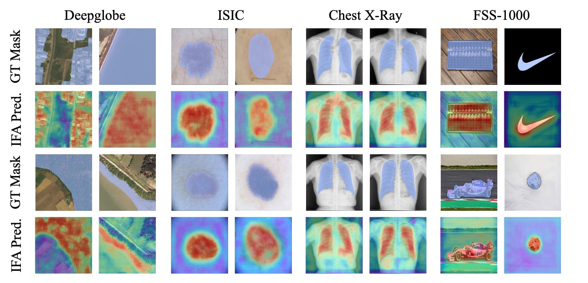

# [CVPR 2024] Cross-Domain Few-Shot Segmentation via Iterative Support-Query Correspondence Mining

The official implementation of "Cross-Domain Few-Shot Segmentation via Iterative Support-Query Correspondence Mining".

More detailed information is in the [PAPER](https://arxiv.org/pdf/2401.08407.pdf).

 Authors: [Jiahao Nie<sup>*</sup>](https://scholar.google.com/citations?user=LGM10RQAAAAJ&hl=zh-CN&inst=8669986779262753491&oi=ao) [Yun Xing<sup>*</sup>](https://scholar.google.com/citations?user=uOAYTXoAAAAJ&hl=zh-CN&inst=8669986779262753491&oi=ao), [Gongjie Zhang](https://scholar.google.com/citations?user=sRBTPp4AAAAJ&hl=zh-CN&inst=8669986779262753491&oi=ao), [Pei Yan](https://scholar.google.com/citations?user=XnvspFEAAAAJ&hl=zh-CN&inst=8669986779262753491&oi=ao), [Aoran Xiao](https://scholar.google.com/citations?user=yGKsEpAAAAAJ&hl=zh-CN&inst=8669986779262753491&oi=ao), [Yap-Peng Tan](https://scholar.google.com/citations?user=t9EqYQIAAAAJ&hl=zh-CN&inst=8669986779262753491&oi=ao)</a>, [Alex C. Kot](https://scholar.google.com/citations?user=UGZXLxIAAAAJ&hl=zh-CN&inst=8669986779262753491&oi=ao), [Shijian Lu](https://scholar.google.com/citations?user=uYmK-A0AAAAJ&hl=zh-CN&inst=8669986779262753491&oi=ao)

 <p align="middle">
    
</p>


## Datasets
The following datasets are used for evaluation in CD-FSS:

### Source domain: 
* **PASCAL VOC2012**:

    Download PASCAL VOC2012 devkit (train/val data):
    ```bash
    wget http://host.robots.ox.ac.uk/pascal/VOC/voc2012/VOCtrainval_11-May-2012.tar
    ```
    Download PASCAL VOC2012 SDS extended mask annotations from [[Google Drive](https://drive.google.com/file/d/10zxG2VExoEZUeyQl_uXga2OWHjGeZaf2/view?usp=sharing)].

### Target domains: 
* **Deepglobe**:
  
    Home: http://deepglobe.org/

    Direct: https://www.kaggle.com/datasets/balraj98/deepglobe-land-cover-classification-dataset   

    Data Preprocessing Code: Please refer [preprocess_deepglobe.py](https://github.com/niejiahao1998/IFA/tree/master/data/preprocess_deepglobe.py) or [PATNet repo](https://github.com/slei109/PATNet).

* **ISIC2018**:
  
    Home: http://challenge2018.isic-archive.com

    Direct (must login): https://challenge.isic-archive.com/data#2018

    Class Information: data/isic/class_id.csv

    Data Preprocessing Code: Please refer [preprocess_isic.py](https://github.com/niejiahao1998/IFA/tree/master/data/preprocess_isic.py) or [PATNet repo](https://github.com/slei109/PATNet).

* **Chest X-ray**:
  
    Home: https://www.ncbi.nlm.nih.gov/pmc/articles/PMC4256233/

    Direct: https://www.kaggle.com/datasets/nikhilpandey360/chest-xray-masks-and-labels

* **FSS-1000**:
  
    Home: https://github.com/HKUSTCV/FSS-1000

    Direct: https://drive.google.com/file/d/16TgqOeI_0P41Eh3jWQlxlRXG9KIqtMgI/view

## Pre-trained ResNet Models
Download pre-trained ResNet models: [GoogleDrive](https://drive.google.com/drive/folders/1oeDfNks2ToOlsDlMArozLx2z2l1QDP51?usp=sharing)

## Performance and Trained Models
Download trained models: [GoogleDrive](https://drive.google.com/drive/folders/1X8QhB2hd16bFLT7o9ZlDIw1oaygV1Tdz?usp=share_link)

| Datasets    | Setting  | mIOU     | Setting  | mIOU     |
| --------    | -------- | -------- | -------- | -------- |
| Deepglobe   | 1-Shot   | 50.6%    | 5-Shot   | 58.8%    |
| ISIC        | 1-Shot   | 66.3%    | 5-Shot   | 69.8%    |
| Chest X-Ray | 1-Shot   | 74.0%    | 5-Shot   | 74.6%    |
| FSS-1000    | 1-Shot   | 80.1%    | 5-Shot   | 82.4%    |

<p align="middle">
    
</p>

### File Organization
```
    IFA/                                                # project file
    ├── dataset/                                        # dataset
    |   ├── VOC2012/                                    # source dataset: pascal voc 2012
    |   |   ├── JPEGImages/
    |   |   └── SegmentationClassAug/
    |   ├── Deeoglobe                                   # target dataset: deepglobe
    |   |   ├── 01_train_ori/                           # original data
    |   |   ├── ...
    |   |   └── 04_train_cat/                           # processed data
    |   |       ├── 1/                                  # category
    |   |       |   └── test/
    |   |       |       ├── origin/                     # image
    |   |       |       └── groundtruth/                # mask
    |   |       └── ...    
    |   ├── ISIC/                                       # target dataset: isic
    |   |   ├── ISIC2018_Task1-2_Training_Input/        # image
    |   |   |   ├── 1/                                  # category
    |   |   |   └── ...
    |   |   └── ISIC2018_Task1_Training_GroundTruth/    # mask
    |   |       └── ...
    |   ├── LungSegmentation/                           # target dataset: chest x-ray
    |   |   ├── CXR_png/                                # image
    |   |   └── masks/                                  # mask
    |   └── FSS-1000                                    # target dataset: fss-1000
    |       ├── ab_wheel/                               # category
    |       └── ...
    |    
    ├── pretrained/                                     # pretrained resnet models
    |   ├── resnet50.pth
    |   └── resnet101.pth
    |
    └── trained_models/                                 # official trained models
        ├── deepglobe/                                  # target dataset
        └── ...
```

## Run the code
Please refer the scripts in `all.sh` to train, fine-tune, and evaluate your models.

Here is an example on Deepglobe dataset:
First, you need to train a model on the source dataset:
```
CUDA_VISIBLE_DEVICES=0 python -W ignore train.py \
  --dataset deepglobe --data-root ./dataset \
  --backbone resnet50 --batch-size 12 --shot 1 --refine
```
Then, you need to use IFA to fine-tuning the trained model on the target dataset:
```
CUDA_VISIBLE_DEVICES=0 python -W ignore ifa.py \
  --dataset deepglobe --data-root ./dataset \
  --backbone resnet50 --batch-size 12 --shot 1 --refine --lr 0.0005
```

You can use our trained models for evaluation directly:
```
CUDA_VISIBLE_DEVICES=0 python -W ignore test.py \
  --dataset deepglobe --data-root ./dataset \
  --backbone resnet50 --batch-size 96 --shot 1 --refine
```

Please note that the performances may flutuate within a small range because of differnet batch-sizes, seeds, devices, and environments.

## Citation
If you use this codebase for your research, please consider citing:
```bash
 @article{nie2024cross,
  title={Cross-Domain Few-Shot Segmentation via Iterative Support-Query Correspondence Mining},
  author={Nie, Jiahao and Xing, Yun and Zhang, Gongjie and Yan, Pei and Xiao, Aoran and Tan, Yap-Peng and Kot, Alex C and Lu, Shijian},
  journal={arXiv preprint arXiv:2401.08407},
  year={2024}
}
 ```

## Acknowledgement
Our codebase is built based on [PATNet](https://github.com/slei109/PATNet) and [SSP](https://github.com/fanq15/SSP)'s official code.

We also thank [HSNet](https://github.com/juhongm999/hsnet) and other FSS and CD-FSS works for their great contributions.

## Reference
[1] Shuo Lei, Xuchao Zhang, Jianfeng He, Fanglan Chen, Bowen Du, and Chang-Tien Lu. Cross-domain few-shot semantic segmentation. ECCV, 2022.

[2] Qi Fan, Wenjie Pei, Yu-Wing Tai, and Chi-Keung Tang. Self-support few-shot semantic segmentation. ECCV, 2022.

[3] Juhong Min, Dahyun Kang, and Minsu Cho. Hypercorrelation squeeze for few-shot segmentation. ICCV, 2021.
